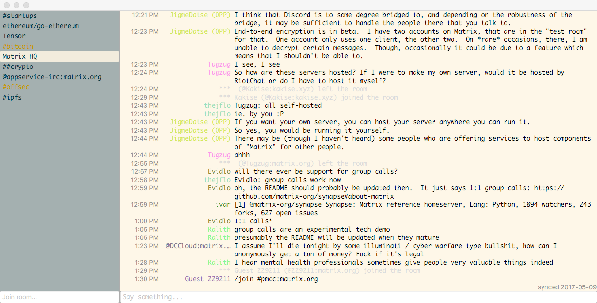

# Tensor
Tensor is an IM client for the [Matrix](https://matrix.org) protocol in development. [](https://travis-ci.org/davidar/tensor)


## Pre-requisites
- a Git client (to check out this repo)
- a C++ toolchain that can deal with Qt (see a link for your platform at http://doc.qt.io/qt-5/gettingstarted.html#platform-requirements)
- Qt 5 (either Open Source or Commercial)

## Linux


### Installing pre-requisites
Just install things from "Pre-requisites" using your preferred package manager.

### Building
From the root directory of the project sources:
```
make
```

## Android

[](https://f-droid.org/repository/browse/?fdid=io.davidar.tensor)

Alternatively, [Download *Qt for Android*](http://www.qt.io/download-open-source/#section-2), open `tensor.pro` in Qt Creator, and [build for Android](http://doc.qt.io/qt-5/androidgs.html).


## OS X



Build `tensor.pro` with Qt Creator, or:

```
brew install qt5
make
```

## iOS


- [Qt for iOS](http://doc.qt.io/qt-5/ios-support.html)
- [Qt5 Tutorial: Bypass Qt Creator and use XCode](https://www.youtube.com/watch?v=EAdAvMc1MCI)

## Windows


Build `tensor.pro` with Qt Creator.

## ARM lxc build

First we create a container
```
sudo lxc-create -n vivid-armhf -t ubuntu -- -b utouch -a armhf -r vivid
```

Edit the config and add mounts and network support:

```
sudo nvim /var/lib/lxc/vivid-armhf/config
# Template used to create this container: /usr/share/lxc/templates/lxc-ubuntu
# Parameters passed to the template: -b utouch -a armhf -r vivid
# Template script checksum (SHA-1): 704a37e3ce689db94dd1c1a02eae680a00cb5a82
# For additional config options, please look at lxc.container.conf(5)

# Uncomment the following line to support nesting containers:
#lxc.include = /usr/share/lxc/config/nesting.conf
# (Be aware this has security implications)

## Network
lxc.utsname = vivid-armhf
lxc.network.type = veth
lxc.network.flags = up
lxc.network.link = lxcbr0

# Common configuration
lxc.include = /usr/share/lxc/config/ubuntu.common.conf

# Container specific configuration
lxc.rootfs = /var/lib/lxc/vivid-armhf/rootfs
lxc.rootfs.backend = dir
lxc.utsname = vivid-armhf
lxc.arch = armhf

# Network configuration
lxc.mount.entry = /home/utouch home/utouch none bind 0 0
lxc.mount.entry = /opt/develop  opt/develop none bind 0 0
```

Start the container: 

```
sudo lxc-start -n vivid-armhf
```

Connect to it:

```
sudo lxc-console -n vivid-armhf
```

Stop it:

```
sudo lxc-stop -n vivid-armhf
```
